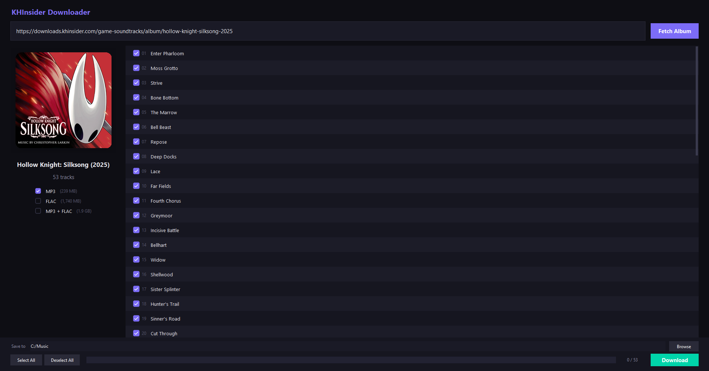

# KHInsider Downloader

A desktop app for downloading soundtracks from [KHInsider](https://downloads.khinsider.com/). Grabs full albums in MP3 or FLAC, embeds HD album art and metadata into every track.



## Download

Grab the latest `.exe` from the [Releases](https://github.com/junaaper/KHInsider-Downloader/releases) page — no Python install needed.

## What it does

- Downloads full albums by pasting a KHInsider URL
- Supports **MP3**, **FLAC**, or **both** (saves into separate subfolders)
- Fetches HD album art from the page and embeds it into MP3 tags
- Tags tracks with title, artist, album name, and track number
- Shows per-track progress with download speed and file sizes
- Displays total album size per format before you download
- 4 concurrent downloads

## Running from source

```
pip install requests beautifulsoup4 mutagen pillow
```

```
git clone https://github.com/junaaper/KHInsider-Downloader.git
cd KHInsider-Downloader
python main.py
```

## Building the exe

```
pip install pyinstaller
python -m PyInstaller --onefile --windowed --name "KHInsider Downloader" --icon=app.ico main.py
```

The exe will be in `dist/`.

## Branches

- `main` — current GUI version
- `cli` — original command-line version
